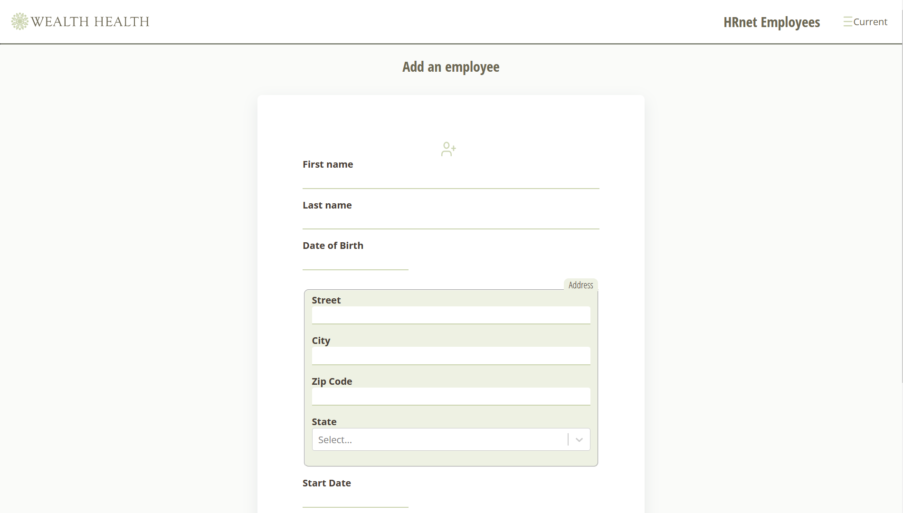
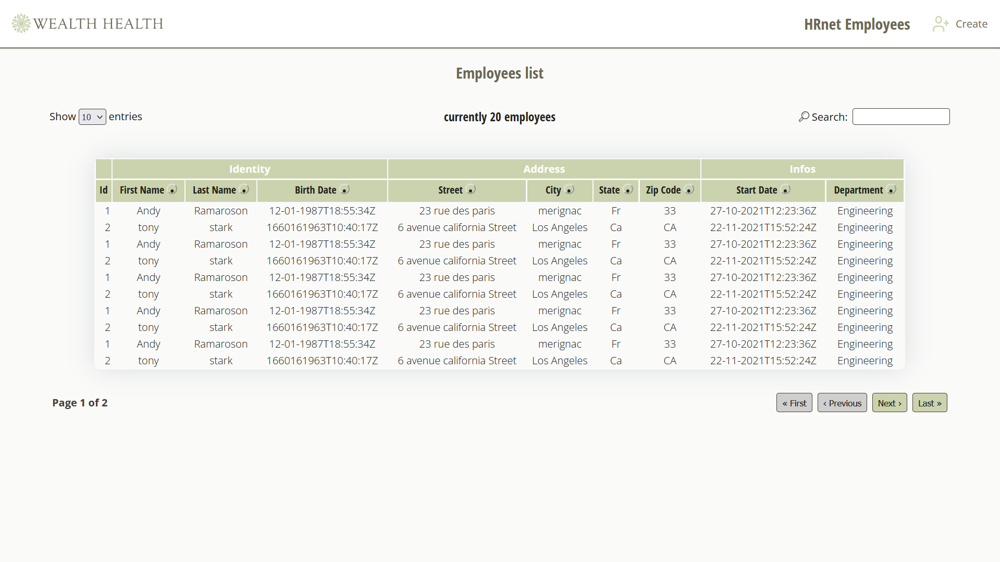

# WealthHealth - HRnet 🇫🇷  

<kbd></kbd>

<kbd></kbd>

> PROBLEMATIQUE

Utilisation en interne d'une application de gestion RH représentant 90% de la dette technologique de l'entreprise

> BESOINS

- Convertir l'application HRnet (code source 100% JQuery) en une application React
- Convertir les plugins sources : 
  - sélecteur de date
  - fenêtre modale
  - menus déroulants
  - tables de données
- Comparer de performances entre l'ancienne et la nouvelle version

## Compétences développées

- [x] Refondre une application pour réduire la dette technique `JQUERY to REACT`
- [x] Implémenter avec la programmation fonctionnelle `JAVASCRIPT`
- [x] Créer un plugin et publier sa propre bibliothèque `REACT | NPM`
- [x] Proposer un design graphique complet, harmonieux et cohérent avec l'identité de l'entreprise
- [x] Déployer une application front-end `NPM`
- [x] Analyser la performance d'une application web `LIGHTHOUSE`

## Ressources fournies

* [HRnet : code source](https://github.com/OpenClassrooms-Student-Center/P12_Front-end)
* [Issues](https://github.com/OpenClassrooms-Student-Center/P12_Front-end/issues)

## Bibliothèques

    REACT
    andyrama-modal

## Installation

### Editeur recommandé

* [Visual Studio code](https://code.visualstudio.com/)

### Prérequis

* [Git](https://git-scm.com/) pour cloner les repos
* [nodeJS](https://nodejs.org/fr/) (version 17.3.0) pour exécuter les commandes
* [npm](https://www.npmjs.com/) (version 8.3.0) pour lancer l'application

### Dépendances

*  [react](https://fr.reactjs.org/docs/getting-started.html) (version 18.2.0)
*  [react-router-dom](https://reactrouter.com/web/guides/quick-start) (version 6.6.1)
*  [prop-types](https://fr.reactjs.org/docs/typechecking-with-proptypes.html) (version 15.8.0)
*  [react-datepicker](https://reactdatepicker.com/) (version 4.8.0)
*  [date-fns](https://date-fns.org/docs/Getting-Started) (version 2.27.0)
*  [react-select](https://react-select.com/home#getting-started) (version 5.7.0)
*  [react-table](https://react-table.tanstack.com/docs/installation) (version 7.8.0)
*  [andyrama-modal](https://www.npmjs.com/package/andyrama-modal)[](https://www.npmjs.com/package/andyrama-modal)

### Lancement du front-end

- [x] Cloner le repo : `gh repo clone AndyRama/AndyRamaroson_14_25112021`
- [x] Aller dans ce dossier : `cd hrnet`
- [x] Installer ses dépendances : `npm install`
- [x] Lancer l'application : `npm start`

```bash
URL de visualisation du rendu web : http://localhost:3000
```
___

# WealthHealth - HRnet 🇬🇧

### Recommanded IDE

* [Visual Studio code](https://code.visualstudio.com/)

### Prerequisites

* [Git](https://git-scm.com/) to clone repositories
* [nodeJS](https://nodejs.org/fr/) to run commands
* [npm](https://www.npmjs.com/) to run application

### Dependances

*  [react](https://fr.reactjs.org/docs/getting-started.html) (version 18.2.0)
*  [react-router-dom](https://reactrouter.com/web/guides/quick-start) (version 6.6.1)
*  [prop-types](https://fr.reactjs.org/docs/typechecking-with-proptypes.html) (version 15.8.0)
*  [react-datepicker](https://reactdatepicker.com/) (version 4.8.0)
*  [date-fns](https://date-fns.org/docs/Getting-Started) (version 2.27.0)
*  [react-select](https://react-select.com/home#getting-started) (version 5.7.0)
*  [react-table](https://react-table.tanstack.com/docs/installation) (version 7.8.0)
*  [andyrama-modal](https://www.npmjs.com/package/andyrama-modal)
### Installing and launching front-end

- [x] Clone the repository: `gh repo clone AndyRama/AndyRamaroson_14_25112021`
- [x] Move to this folder: `cd hrnet`
- [x] Install dependencies: `npm install`
- [x] Launch application: `npm start`

```bash
Front-end is now rendered at URL http://localhost:3000
```